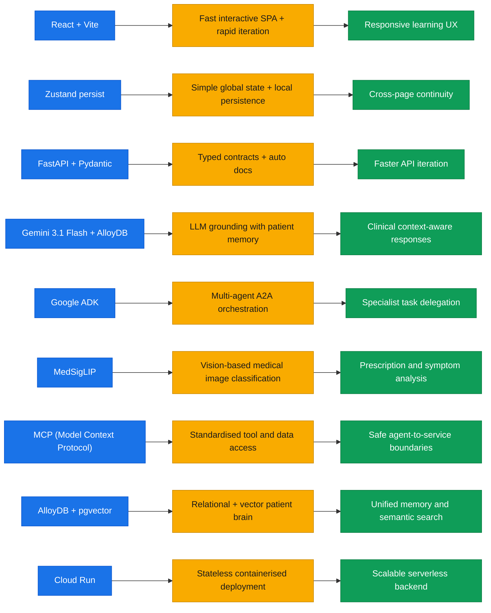
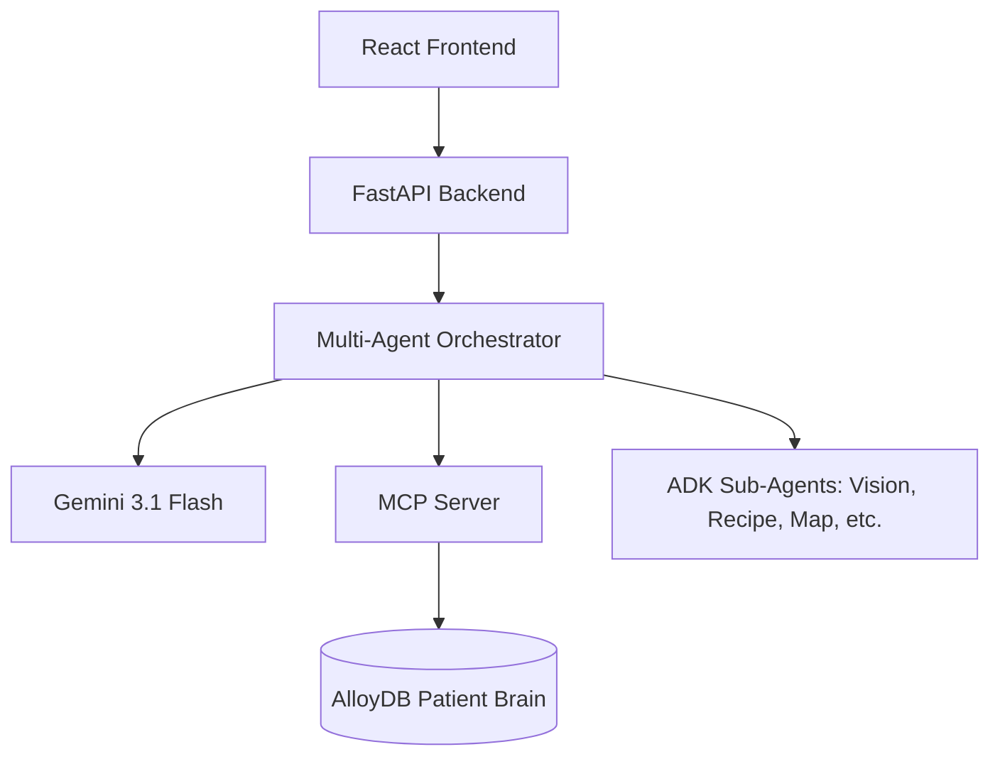
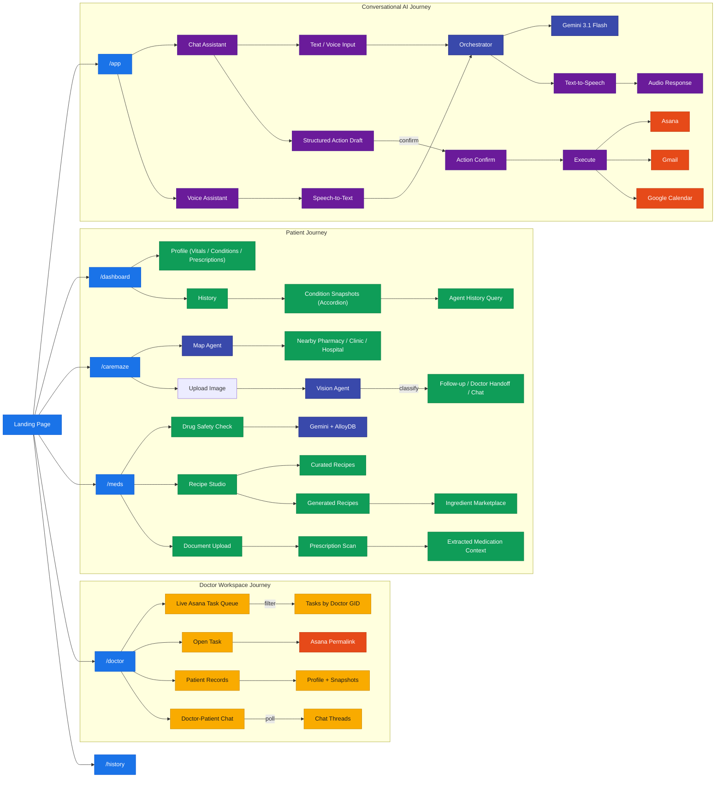
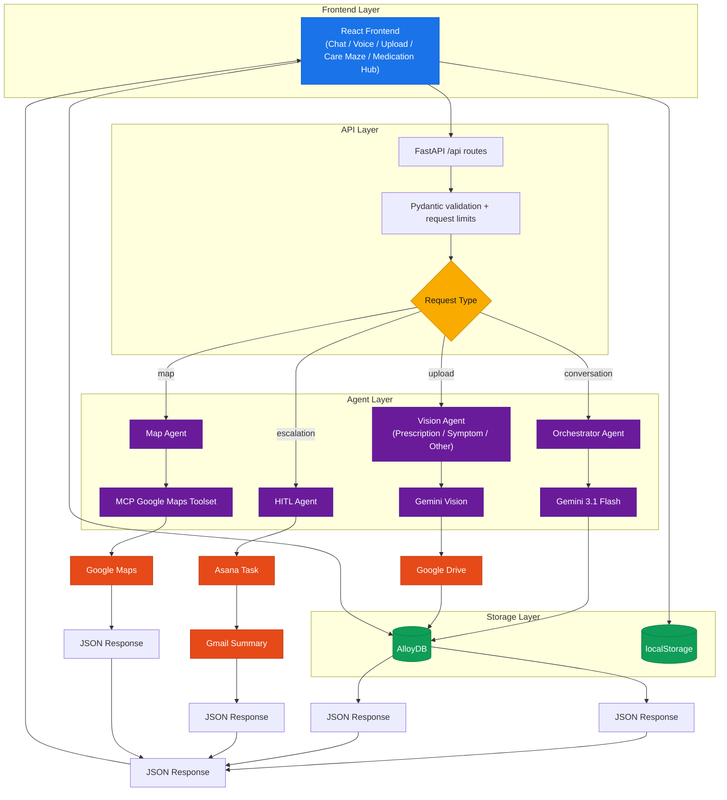
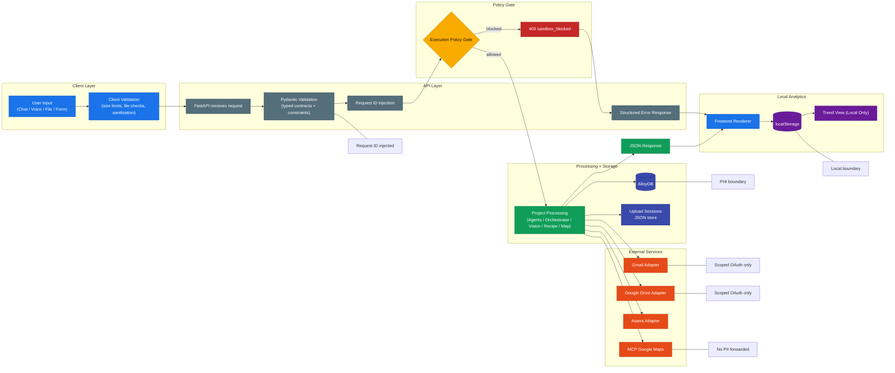

# nexus_ai

**An AI-powered multi-agent healthcare platform** that provides personalized chronic care management through intelligent conversational AI, real-time medication safety analysis, and transparent human-in-the-loop doctor handoffs.

>  **⚠️ DISCLAIMER:**
> This working demo currently has a **free-tier API key** attached to it; access to the necessary models may be limited. Thus, while experiencing some of the features shown in the video, this happened due to **the billing issues in my account**.  I tried my best to make sure my project holds up to the video, & i had my internals.So, thank you for your notice. Continue down. 


Cloud Run API endpoint (for testing):
https://cure-quest-api-315569715049.us-central1.run.app

## Table of Contents
- [Project Overview](#project-overview)
- [Demo Media](#demo-media)
- [Quick Start](#quick-start)
- [Tech Stack](#tech-stack)
- [Architecture](#architecture)
- [Directory Structure](#directory-structure)
- [Component Index](#component-index)
- [API Contracts](#api-contracts)
- [Data Flow & State Management](#data-flow--state-management)
- [AI/ML Section](#aiml-section)
- [Results and Metrics](docs/results_and_metrics.md)
- [Datasets Used](Datasets/)
- [Styling & Theming](DESIGN.md#styling--theming)
- [Appendix](#appendix)

## Project Overview
nexus_ai coordinates care across multiple dimensions:
- **Voice/Chat AI** for patient questions and follow-up guidance.
- **Document upload** for prescription scans and medical artifacts.
- **HITL review** to produce doctor-ready summaries.
- **Medication reminders** and care notifications.
- **Recipe Studio** for condition-aware culinary guidance (curated from AlloyDB).
- **HealthConnect Integration** for real-time vitals and watch-based monitoring.
- **Google Workspace integration** for Drive, Calendar, Gmail, Speech, and Maps.

### Demo Story — Shreesha's Care Journey
Shreesha is a 22-year-old patient managing two chronic conditions simultaneously:
- **Atopic Eczema** (moderate to severe) — recurring flares on forearms and neck, managed with topical Clobetasol Propionate.
- **Focal Epilepsy** — diagnosed at age 19, currently controlled with Levetiracetam 500 mg twice daily.

The demo walks through drug interaction questions, document uploads, doctor handoff reports, medication reminders, and Gmail-based care summaries.

## Demo Media

## This is an agentic workflow in ADK environment

<!--

.png)

-->

## For detailed diagrams of Agentic breakdown, refer here:
[Agent Diagrams](docs/Agent_Digrams)

## Key Features
### Recipe Studio (Browse Recipes)
The **Recipe Studio** provides personalized nutritional guidance by fetching curated recipes from **AlloyDB** that are safe and beneficial for the patient's specific chronic conditions (e.g., eczema-friendly ingredients).
- **Curated Selection**: Pre-validated recipes for common care journeys.
- **AI-Generated**: Real-time generation of custom recipes based on available ingredients and dietary restrictions.
- **Marketplace Sync**: Direct link to ingredient marketplaces for seamless shopping.

### HealthConnect & Watch Integration
nexus_ai syncs with **Android HealthConnect** to monitor real-time patient vitals (heart rate, sleep, activity) via wearable devices.
- **Patient Brain Sync**: Watch data is periodically pushed to the AlloyDB "Patient Brain" to ground the AI's conversational context.
- **Proactive Alerts**: If abnormal vitals are detected, the system can trigger a proactive check-in or escalate to the Doctor Workspace via Asana.

## Quick Start
### Prerequisites
- Python 3.12+
- Node.js 18+
- Google Cloud project with APIs enabled (Drive, Calendar, Gmail, Speech, Maps)
- AlloyDB instance (or use SQLite for local dev)

### 1) Backend setup
```powershell
# Create virtual environment
python -m venv .venv
.venv\Scripts\Activate.ps1
pip install -e .[dev]

# Configure environment
copy .env.example .env
# Edit .env with your keys

# Seed demo data
python -m nexus_ai.scripts.seed

# Run API
uvicorn nexus_ai.app:app --reload
```

### 2) Frontend setup
```powershell
cd frontend
npm install
npm run dev
```

---

## Tech Stack
### Core
- **Backend**: FastAPI, SQLAlchemy, Pydantic.
- **Database**: AlloyDB (PostgreSQL-compatible) for patient memory.
- **Frontend**: React, Vite, TypeScript, Framer Motion, GSAP.
- **State Management**: Zustand.

### AI & Agents
- **Gemini 3.1 Flash**: Clinical reasoning and conversational engine.
- **MedSigLIP**: Vision-based medical image classification.
- **Google ADK**: Multi-agent orchestration framework.
- **MCP (Model Context Protocol)**: Standardized tool and data access.

---

## Why this stack?



---

## Architecture
### High-Level Design
nexus_ai uses a multi-agent approach where a **Root Agent** (ADK) orchestrates specialized sub-agents.



For detailed sequence diagrams, see [Architecture and Design](docs/ARCHITECTURE_AND_DESIGN.md).

---

## Application Role Flows



---

## Directory Structure
```text
nexus_ai/
├── adk_agents/          # ADK agent packages
├── docs/                # Architecture and design plans
├── frontend/
│   ├── src/
│   │   ├── components/  # Chat, Voice, UI components
│   │   ├── hooks/       # Custom React hooks
│   │   ├── lib/         # API and data utilities
│   │   ├── screens/     # Route pages (Dashboard, CareMaze, etc.)
│   │   └── assets/      # Static assets
│   ├── package.json
│   └── vite.config.ts
├── src/
│   └── nexus_ai/
│       ├── adapters/    # External service connectors (Asana, Gmail, etc.)
│       ├── adk/         # ADK agent logic
│       ├── agents/      # Specialist Python agents
│       ├── api/         # FastAPI routes and models
│       ├── db/          # Database models and bootstrap
│       ├── mcp/         # Model Context Protocol server
│       ├── scripts/     # Utility scripts (seed, test)
│       ├── services/    # Business logic and model routing
│       └── app.py       # Main entry point
└── pyproject.toml
```

## Component Index
### Index Method
Each module is indexed with its purpose, inputs, and complexity. Where exact internals cannot be fully inferred without runtime interaction, entries are marked `manual-review`.

### Pattern-based Detail Map
| Pattern | Purpose | Inputs / Props | State / Lifecycle | Tests | Complexity |
| --- | --- | --- | --- | --- | --- |
| `frontend/src/screens/*` | Route-level composition | Router params + workspace context | React hooks lifecycle | Manual review | Render-bound |
| `frontend/src/components/*` | Shared UI blocks | Component props | React state/effects | Manual review | UI logic |
| `src/nexus_ai/api/*` | FastAPI routes | Pydantic request models | Per-request | `test_api_models.py` | Orchestration |
| `src/nexus_ai/agents/*` | Agent reasoning | Prompt context + tool definitions | Stateless | Unit tests exist | Reasoning O(token) |
| `src/nexus_ai/adapters/*` | Service mediation | Adapter method signatures | Managed sessions | Integration tests | Request-bound |

### Detailed Module Register
| Path | Purpose | Inputs/Props | Internal state/lifecycle | Key methods/exports | External dependencies | Tests | Complexity |
| --- | --- | --- | --- | --- | --- | --- | --- |
| `frontend/src/screens/DashboardScreen.tsx` | Patient home view | Workspace context | Polling/refresh effects | Default component | Framer Motion, GSAP | Manual review | Render-bound |
| `frontend/src/screens/CareMazeScreen.tsx` | Symptom & Map view | Location context | Geolocation effects | Default component | Google Maps, Lucide | Manual review | UI logic |
| `frontend/src/screens/MedicationHubScreen.tsx` | Prescription manager | Patient id | Upload/Delete state | Default component | Axios, Framer Motion | Manual review | List-bound |
| `frontend/src/screens/DoctorWorkspaceScreen.tsx` | Clinician portal | Doctor context | Task queue state | Default component | Asana Adapter | Manual review | O(n) tasks |
| `frontend/src/screens/HistoryScreen.tsx` | Care timeline | Patient history | Grouping/Sorting logic | Default component | Date-fns | Manual review | O(n) events |
| `frontend/src/screens/HITLScreen.tsx` | Doctor review flow | Case id | Review submission state | Default component | Backend HITL API | Manual review | Form-bound |
| `frontend/src/screens/Profile.tsx` | User settings | User session | Edit/Save lifecycle | Default component | Zustand Store | Manual review | Form-bound |
| `frontend/src/components/ChatAssistant.tsx` | Conversational interface | Session id | Message history state | `ChatAssistant` | Backend Chat API | Manual review | O(history) |
| `frontend/src/components/VoiceAssistant.tsx` | Audio interaction | Audio stream | Recording/Speech state | `VoiceAssistant` | Google STT/TTS | Manual review | Async-bound |
| `frontend/src/components/DoctorCard.tsx` | Clinician profile UI | `Doctor` object | Hover/Expand state | `DoctorCard` | Tailwind CSS | Manual review | Render-bound |
| `frontend/src/hooks/useWorkspace.ts` | State provider | Config object | Global state sync | `useWorkspace` | Zustand | Manual review | O(1) access |
| `frontend/src/lib/api.ts` | API transport layer | Request config | Interceptor lifecycle | `api` instance | Axios | Manual review | Request-bound |
| `src/nexus_ai/api/routes.py` | Backend API routes | Pydantic models | FastAPI lifespan | Router definition | Services, Agents | `test_api.py` | O(1) routing |
| `src/nexus_ai/agents/orchestrator.py` | Task delegation | User message | Stateless reasoning | `route_conversation` | Specialist Agents | Unit tests | Intent-bound |
| `src/nexus_ai/mcp/server.py` | Tool access layer | Tool requests | Server lifecycle | `mcp.server` | DB, Services | `test_mcp.py` | Tool-bound |

## API Contracts
nexus_ai uses **Pydantic** for strict API contract enforcement. All requests and responses are typed, ensuring safety between the React frontend and FastAPI backend.
- **Intake**: `POST /patient/intake`
- **Conversation**: `POST /orchestration/conversation-route`
- **Voice**: `POST /orchestration/voice-route`
- **HITL Report**: `POST /orchestration/hitl-report`

## Data Flow & State Management
- **Frontend State**: Managed via **Zustand** for global workspace data and **React Hooks** for local component state.
- **Backend Flow**: Audio/Text -> Orchestrator -> Intent Analysis -> Specialist Agent -> Tool Call (MCP) -> Brain (AlloyDB) -> Response Synthesis -> Patient.



---

## Privacy & Data Flow



---

## AI/ML Section
### Model Routing
- **Gemini 3.1 Flash**: Handles complex reasoning, patient check-ins, and multi-turn chat. It leverages AlloyDB grounding to ensure responses are clinical-context-aware.
- **MedSigLIP**: Integrated for specialized image classification tasks, such as identifying prescription labels and symptom severity from photos.

### Agentic Patterns
- **Google ADK**: Enables A2A (Agent-to-Agent) delegation. For example, the Vision Agent can delegate to the Recipe Agent when it detects a dietary restriction in an uploaded document.
- **MCP (Model Context Protocol)**: Exposes "Tools" for the agents to safely interact with the database and external APIs (Maps, Calendar, etc.) in a standardized way.

---

## Testing
- **Unit Tests**: Located in `tests/`, covering adapters and core services.
- **Integration Tests**: In `tests/integration/`, validating the full path from API to Database.
- **Connectivity Tests**: `scripts/test_database_connection.py` and `scripts/test_mcp_connection.py`.

---

## Datasets Used
The platform's AI models and grounding services are validated against the following clinical datasets:
- [Clinical Medication Samples (Indian Market)](Datasets/Indian_medicine_sample_100.csv)
- [Drug-Drug Interaction Mappings](Datasets/drug_interactions.csv)

For performance benchmarks and OCR accuracy results derived from these datasets, see [Results and Metrics](docs/results_and_metrics.md).

---

## Appendix
- [Connection Architecture](docs/CONNECTION_ARCHITECTURE.md)
- [Wiring Checklist](docs/WIRING_CHECKLIST.md)
- [Cloud Run Deployment](docs/CLOUD_RUN_DEPLOYMENT.md)

