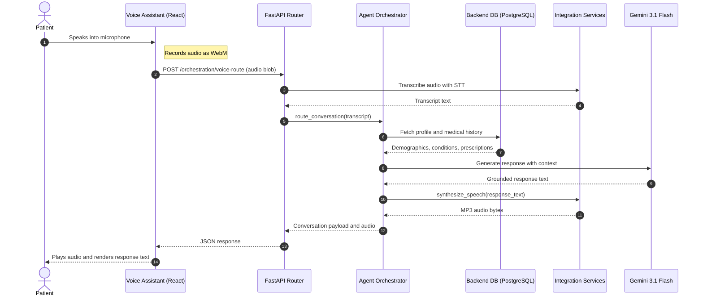
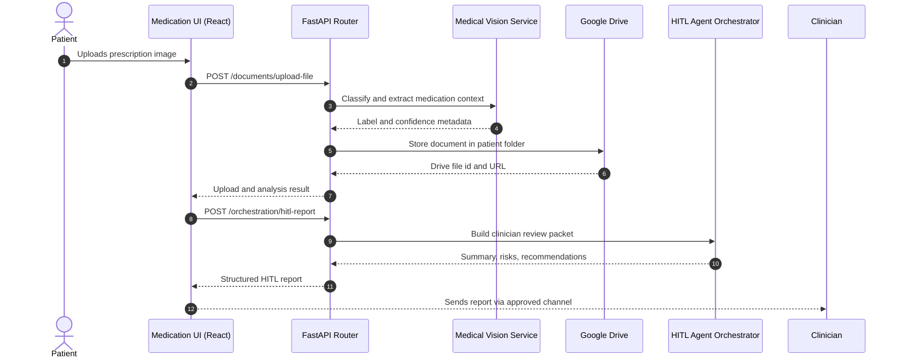

# nexus_ai Architecture and Design Documentation

This document defines the production-intent architecture for nexus_ai, including system boundaries, agent responsibilities, integration contracts, and operational guidance.

It complements:

- [CONNECTION_ARCHITECTURE.md](CONNECTION_ARCHITECTURE.md) for infrastructure connection paths
- [WIRING_CHECKLIST.md](WIRING_CHECKLIST.md) for practical setup and validation steps
- [DESIGN.md](../DESIGN.md) for frontend visual system and UX language

## How to Use This Document

Use this reading order based on role:

- Product and engineering leads: Sections 1, 2, 3, 9, 13, 14
- Backend engineers: Sections 4, 5, 6, 7, 8, 10, 11, 12
- Frontend engineers and designers: Sections 3, 5, 6, 16
- QA and reliability: Sections 7, 10, 11, 12, 13

## 1. Executive Summary

nexus_ai is a multi-agent healthcare assistant platform built around:

- React frontend experiences (chat, voice, medication workflows, history)
- FastAPI backend APIs and orchestration routes
- A central Orchestrator that routes tasks to specialist agents and services
- A shared patient brain backed by SQLAlchemy and PostgreSQL/Postgres-compatible storage
- External integrations (Google Workspace, Speech, BigQuery, Task Queue, Gemini 3.1 Flash)

Design goals:

- Safe and explainable chronic care assistance
- Fast multimodal interactions (text, voice, document upload)
- Human-in-the-loop escalation to clinicians
- Modular integrations with explicit tool and service boundaries

## 2. Architecture Principles

1. Orchestrator-first coordination
The Orchestrator owns intent analysis, delegation, and response composition.

2. Shared patient context
All runtime paths read and write to a consistent patient state model.

3. Integration isolation
External providers are accessed through adapters or tool boundaries to reduce blast radius.

4. Progressive reliability
Develop in direct mode first, then validate MCP mode and full agent tool routing.

5. Human oversight for risk
High-risk outputs must support HITL workflows and traceable audit logs.

## 3. High-Level System Architecture

```mermaid
graph TD
    %% Frontend Layer
    subgraph Frontend [React Frontend Suite]
        UI[User Interface]
        Voice[Voice Assistant Native Mic/Audio]
        Chat[Chat Assistant Pop-up]
        UI --> Voice
        UI --> Chat
    end

    %% Backend API Layer
    subgraph FastAPI [Backend Application]
        Routes[API Routes: /orchestration/*]
    end

    %% Orchestration Layer
    subgraph OrchestratorLayer [Multi-Agent Orchestrator]
        Orchestrator((Orchestrator Agent))
        ModelRouter[Model Routing Service]
        CommAgent[Communications Agent]
        IntegAgent[Integrations Agent]
        HITLAgent[HITL Agent]
    end

    %% Tool & Data Boundary
    subgraph MCPBoundary [MCP Tool Layer]
        MCPServer[Local MCP Server]
        GoogleMaps[MCP Google Maps]
    end

    %% Data & External Services Layer
    subgraph ExternalServices [External Integrations and Data]
        Brain[(PostgreSQL Patient Brain)]
        Speech[Google Cloud STT and TTS]
        Workspace[Google Workspace: Drive, Gmail, Cal]
        Task Queue[Task Queue Task Escalation]
        HealthConnect[Android HealthConnect]
        BigQuery[(BigQuery Analytics)]
        Gemini[Gemini 3.1 Flash]
    end

    %% ADK Agent Layer
    subgraph ADKAgents [ADK Sub-Agents]
        VisionAgt[Vision Agent]
        RecipeAgt[Recipe Agent]
        QuestAgt[Questioner Agent]
        DataAgt[Data Fetcher Agent]
    end

    %% Flow Connections
    Voice <--> |Audio WebM| Routes
    Chat <--> |Text / JSON| Routes

    Routes <--> |Orchestrate Core| Orchestrator
    Routes <--> |Orchestrate Finance| FinanceOrch

    Orchestrator --> |Patient History| Brain
    Orchestrator --> |Reasoning| Gemini
    Orchestrator <--> |Tool Access| MCPServer

    MCPServer <--> Brain
    MCPServer <--> Workspace
    MCPServer <--> GoogleMaps

    IntegAgent --> |Transcription| Speech
    IntegAgent --> |Log Trails| BigQuery
    IntegAgent --> |Wearable Sync| HealthConnect

    HITLAgent --> |Create Task| Task Queue

    %% ADK delegation
    Orchestrator -.-> |ADK A2A| VisionAgt
    Orchestrator -.-> |ADK A2A| RecipeAgt
    Orchestrator -.-> |ADK A2A| QuestAgt
    Orchestrator -.-> |ADK A2A| DataAgt

    %% Patient Finance Subgraph
    subgraph FinanceSuite [Patient Financial Advocate]
        FinanceOrch((Finance Orchestrator))
        BillingAgt[Billing Agent]
        GapAgt[Gap Agent]
        LoanBrokerAgt[Loan Broker Agent]
        ConsentGate[Consent Gate]
    end

    FinanceOrch --> BillingAgt
    FinanceOrch --> GapAgt
    FinanceOrch --> LoanBrokerAgt
    FinanceOrch --> ConsentGate
    FinanceOrch <--> |GridFS / Collections| MDB[(MongoDB Store)]
    FinanceOrch --> |Observability| Phoenix[Arize Phoenix]
    FinanceOrch --> |Anonymize PHI| Presidio[Microsoft Presidio]
```

## 4. Runtime Components and Ownership

### Frontend

- Hosts patient-facing workflows (dashboard, care maze, medication hub, HITL views, and the Financial Advocate screen)
- Captures voice input, file uploads, and PDF bill uploads
- Calls backend APIs through typed request models and streams audit SSE events

### FastAPI API Layer

- Exposes bounded endpoints under patient, orchestration, documents, patient finance, and integrations domains
- Validates payloads, manages auth/session context, and normalizes responses
- Delegates business logic to services and agents

### Orchestrator and Specialist Agents

- Orchestrator: intent routing, state-aware planning, and response synthesis
- Communications Agent: empathetic patient-facing language generation
- Integrations Agent: tool and provider orchestration across speech, calendar, drive, and analytics
- HITL Agent: clinician handoff packaging, report generation, escalation metadata
- **Patient Finance Orchestrator**: coordinates the billing audit, out-of-pocket gap analysis, and credit matchmaking workflows.
  - **Billing Agent**: handles itemized billing layout extraction and duplicate check audits.
  - **Gap Agent**: executes coverage policy comparisons and out-of-pocket gap math.
  - **Loan Broker Agent**: compares, matches, and ranks financing offers.
  - **Consent Gate**: verifies patient authorization before external loan submission.

### Brain and Database Layer

- Shared patient memory model across API and tool-driven paths
- **Multi-database setup**:
  - **PostgreSQL (PostgreSQL)**: handles patient bio, vital timelines, chronic condition schemas, and medication reminders.
  - **MongoDB**: handles unstructured medical bills (PDFs via GridFS), parsed line items, billing audit flags, credit offers, insurance policy text chunks, and consent signatures.
- Supports direct access mode and MCP-mediated access mode

### Tool and Agent Runtime (ADK and MCP)

- ADK package for agent web testing and tool invocation
- Local MCP server exposing deterministic tools and DB-backed operations
- Enables contract testing independent of frontend flow

### ADK Sub-Agent Architecture (A2A)

The ADK layer uses explicit agent-to-agent (A2A) delegation:

- **Root Agent** (`nexus_ai_root`): Central orchestration hub. Delegates to all sub-agents.
  - Vision Agent: uploaded medical image analysis
  - Recipe Agent: diet-safe recipe generation
  - Communication Agent: email/chat/calendar wording
  - Questioner Agent: missing user decisions and action confirmation
  - Data Fetcher Agent: PostgreSQL grounded lookup and patient context
  - Map Agent: Care Maze location search and route generation
- **Vision Agent** (`nexus_ai_vision_agent`): Delegates to:
  - Recipe Agent: when medication/diet is relevant
  - Communication Agent: for patient-friendly summary composition
  - Questioner Agent: if doctor/action confirmation is needed
- **Data Fetcher Agent** (`nexus_ai_data_fetcher_agent`): Provides:
  - Medicine facts from PostgreSQL
  - Patient profile snapshots
  - Historical condition context
- **Map Agent** (`nexus_ai_map_agent`): Provides:
  - Nearby care destination search via Google Maps MCP
  - Navigation route generation

## 5. Core Interaction Flow: Voice Care Journey



## 6. Core Interaction Flow: Document and HITL Journey



## 7. Integration Matrix

| Integration | Primary Purpose | Entry Point | Failure Mode Handling |
|---|---|---|---|
| Google STT and TTS | Voice transcription and synthesis | Flights or audio routes | Return text-only fallback when audio generation fails |
| Google Drive and Calendar | File storage and reminder scheduling | Documents and reminders APIs | Persist partial success and surface next action to user |
| Gmail | Care summary delivery | Notification or summary APIs | Queue retry with error metadata |
| BigQuery | Audit and event analytics | Integration logging service | Non-blocking fire-and-forget with retry path |
| Task Queue | Escalation and tasking | Ticketing adapter | Local escalation record if remote ticketing fails |
| Gemini 3.1 Flash | Conversation, clinical reasoning, and multimodal analysis | Model router and communication flows | Route to backup model policy and log trace |
| Gemini Vision | Vision classification workflows | Document and retrieval services | Degrade to rules-based extraction if model unavailable |
| MongoDB + GridFS | Patient billing files, parsed layout items, and credit offers | Patient finance router (`/api/finance`) | Fallback to clean state; local logging of database operations |
| Arize Phoenix | OpenTelemetry tracing and LLM performance debugging | OpenTelemetry spans & exporter | Silent failure; trace errors do not disrupt main thread logic |
| Microsoft Presidio | Local PHI de-identification and scrubbing | Privacy redaction module (`privacy.py`) | Reject highly sensitive payloads or proceed with strict anonymization |

## 8. API Capability Map

This map links major user capabilities to backend route groups.

| Capability | Route Group | Representative Endpoints |
|---|---|---|
| Patient intake and profile bootstrap | Patient APIs | /patient/intake, /demo/patient/{patient_id}/workspace |
| Text and voice conversation | Orchestration APIs | /orchestration/conversation-route, /orchestration/voice-route |
| Medication safety checks | Medical and patient APIs | /drug/label, /patient/check-alternatives |
| Document ingestion and classification | Document APIs | /documents/upload-file |
| HITL report generation | Orchestration APIs | /orchestration/hitl-report, /orchestration/hitl-comprehension |
| Reminders and scheduling | Patient and calendar APIs | /patient/reminders, /calendar/events |
| Workspace and communications sync | Auth and Gmail APIs | /auth/google, /auth/google/status/{patient_id}, /gmail/* |

## 8.1 Adapter-Derived Agent Capabilities (Notebook-Aligned)

Using the `notebooks/medical_input_for_adapter.ipynb` profiling results, the medical adapter now emphasizes three practical runtime capabilities:

1. Side-effect pattern grounding  
The adapter can provide high-frequency adverse-effect context (for example GI symptoms, rash, headache, and application-site reactions) as structured support for patient-facing explanations.

2. Interaction-coverage awareness  
Because a significant share of records have empty interaction objects, the adapter surfaces a coverage signal rather than over-claiming certainty when interaction evidence is limited.

3. Conservative escalation behavior  
When interaction coverage is weak, orchestration should bias toward constrained guidance plus HITL review, reducing unsafe confidence in autonomous recommendations.

These capabilities are adapter outcomes, not just model prompt behavior: the adapter layer determines what medical evidence is available, what is missing, and how reliability is communicated upstream.

## 9. Data Domains

Key persistent entities include:

### PostgreSQL Relational Store
- **patients**: Patient bio, credentials, demographics
- **chronic_conditions**: Symptoms, severe thresholds
- **prescriptions**: Dosage, frequency, active status
- **medication_events**: Patient adherence history
- **escalation_cases**: HITL clinical tasks
- **notifications**: Alerts pushed to patient device

### MongoDB Document Store
- **bills**: Medical bills metadata, GridFS PDF references, and Google Drive upload links
- **bill_audits**: Audit status, duplicate warnings, price anomaly audits
- **patient_gaps**: Patient out-of-pocket obligations and insurance calculations
- **loan_offers**: Matched financing loans and APR terms
- **policy_chunks**: Grounding chunks for coverage policy retrieval
- **consent_logs**: Checked records of patient signing disclosures

Design intent:

- keep patient identity, care context, and event history normalized
- ensure all agent outputs can be tied to durable patient records
- preserve traceability for escalations and external side effects

## 10. Deployment Topology (Environment Progression)

### Local development

- Frontend via Vite
- API via Uvicorn
- SQLite or local Postgres-compatible URL
- Optional local MCP server for tool contract tests

### Integration environment

- PostgreSQL-backed persistence
- Real Google API credentials and scoped service calls
- ADK and MCP enabled for full tool route validation

### Production intent

- Managed FastAPI runtime behind HTTPS ingress
- PostgreSQL with private networking and credential rotation
- Structured logging and analytics sinks enabled
- Strict access controls on PHI-bearing workflows

## 11. Security, Privacy, and Compliance Guardrails

- Minimize protected data movement; pass only required fields to external providers
- Separate patient identifiers from non-essential analytical payloads
- Log access, tool calls, and escalation actions with timestamps and actor context
- Enforce principle of least privilege for Google scopes and API keys
- Keep secrets in runtime environment management, not source control

Note:
This document is architecture-level guidance and not legal compliance certification.

## 12. Reliability and Observability

Recommended baseline instrumentation:

- request id propagation from frontend through backend and tool calls
- latency and error metrics per endpoint and per integration adapter
- structured logs for orchestration decisions and model/router outcomes
- dead-letter style handling for asynchronous integration failures

Operational SLO examples:

- p95 text orchestration latency under 2.5s
- p95 voice route latency under 6.0s including STT and TTS
- non-critical integration errors under 1 percent per day with retries

## 13. Testing Strategy Alignment

Suggested coverage layers:

- unit tests for agents, model routing, and adapter transformations
- API contract tests for request and response schemas
- integration tests for database, MCP, calendar, drive, and BigQuery paths
- smoke tests for ADK to MCP to DB tool invocation
- frontend interaction tests for critical patient journeys

Repository-aligned tests already include:

- unit tests under tests
- integration tests under tests/integration

## 14. Architecture Risks and Mitigations

1. External API volatility
Mitigation: adapter isolation, retry policies, fallback messaging.

2. Model output variability
Mitigation: constrained prompts, response post-validation, HITL fallback for high-risk domains.

3. Partial workflow failures
Mitigation: idempotent operations, explicit status payloads, resumable user actions.

4. Coupling between orchestration and providers
Mitigation: interface contracts and dependency injection in services/adapters.

## 15. Roadmap Anchors

- Expand FHIR or EHR interoperability surface
- Add policy-driven escalation thresholds and explainability cards
- Introduce stronger event-driven backbone for integration fan-out
- Add compliance-ready audit package and retention policy controls


## 16. Quick Reference

Primary runtime entrypoints:

- FastAPI app: src/nexus_ai/app.py
- ADK agent wrapper: adk_agents/nexus_ai_agent/agent.py
- MCP server module: src/nexus_ai/mcp/server.py

Primary supporting docs:

- Connection architecture: docs/CONNECTION_ARCHITECTURE.md
- Wiring checklist: docs/WIRING_CHECKLIST.md
- Product overview and API list: README.md
